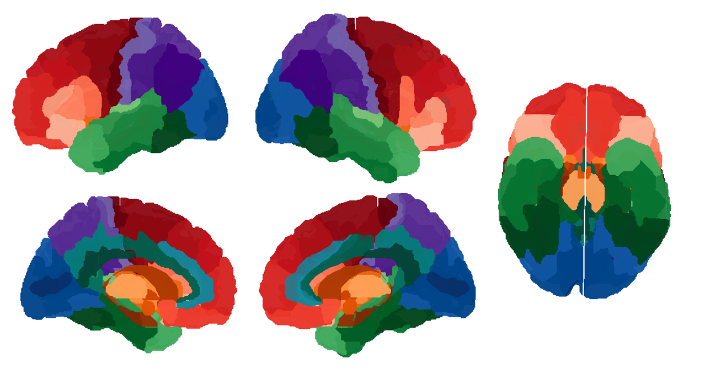
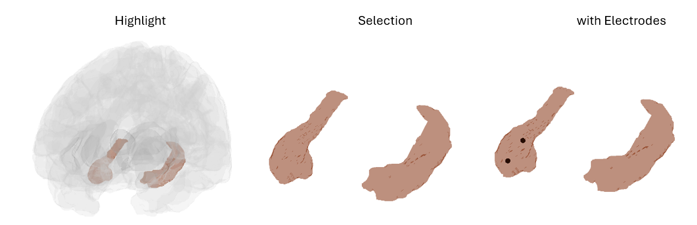

### BA Atlas for interactive plotting of intracranial electrode contacts (sEEG / ECoG) 

Hi!
I was looking for a nice way to create customizable plots of sEEG electrodes in standardized (MNI) space.
My tool is based on the MNI brain model template and BA atlas segmentation from Lacadie et al., (2008) that is also implemented in an interactive online tool of the BioImage Suite (https://bioimagesuiteweb.github.io/webapp/)

Here's an example of customized plots that you can generate with the atlas.

References:
    C.M. Lacadie, R. K. Fulbright, J. Arora, R.T.Constable, and X. Papademetris. Brodmann Areas defined in MNI space using a new Tracing Tool in BioImage Suite. Human Brain Mapping, 2008.

Requirements:
    cbrewer2 - https://de.mathworks.com/matlabcentral/fileexchange/58350-cbrewer2

Uploaded April 04, 2025
